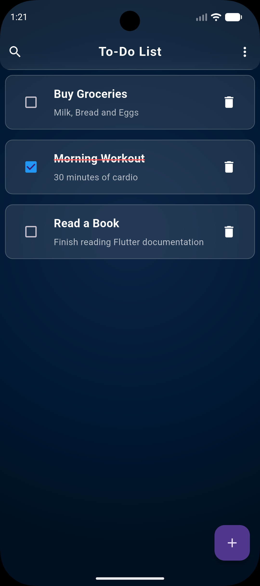
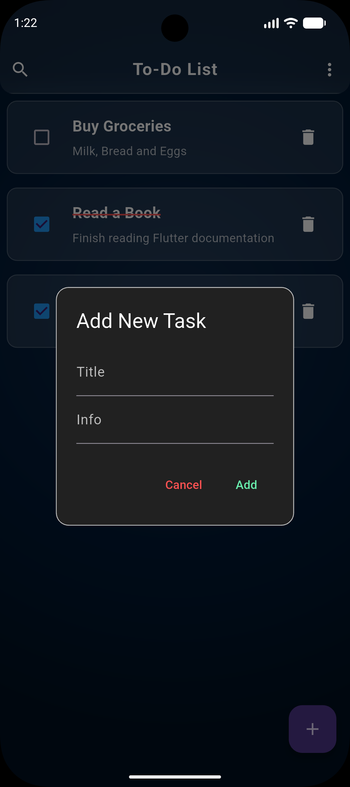
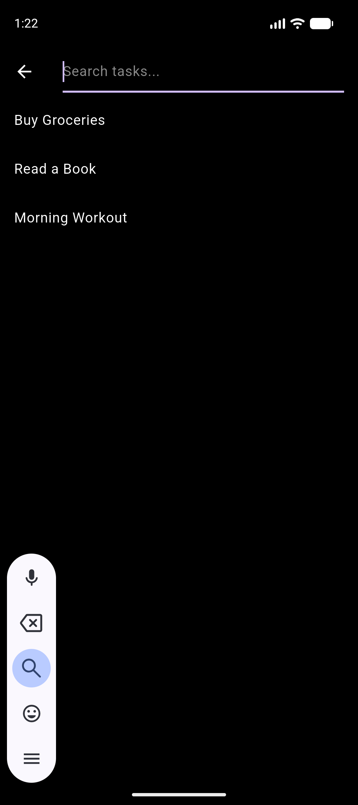

# Glassy To-Do List App

A sleek and modern **To-Do List application** with a glassmorphic design. This app helps you organize your tasks efficiently while providing a visually appealing interface.

---

## Features

- **Add New Tasks:** Quickly add tasks with details.
- **Mark Complete / Incomplete:** Track your progress easily.
- **Delete & Restore Tasks:** Deleted tasks are stored temporarily and can be restored.
- **Search Tasks:** Easily find tasks using the search functionality.
- **Modern Glassy Design:** Clean, translucent interface with smooth animations.

---

## Screenshots

<div align="center">
<table>
  <tr>
    <td align="center">
      <br>
      Homepage
    </td>
    <td align="center">
      <br>
      Deleted Tasks
    </td>
    <td align="center">
      <br>
      Add New Task
    </td>
    <td align="center">
      <br>
      Search Tasks
    </td>
  </tr>
</table>
</div>


---

## Installation

Clone the repository:

```bash
git clone https://github.com/yourusername/glassy-todo-app.git
